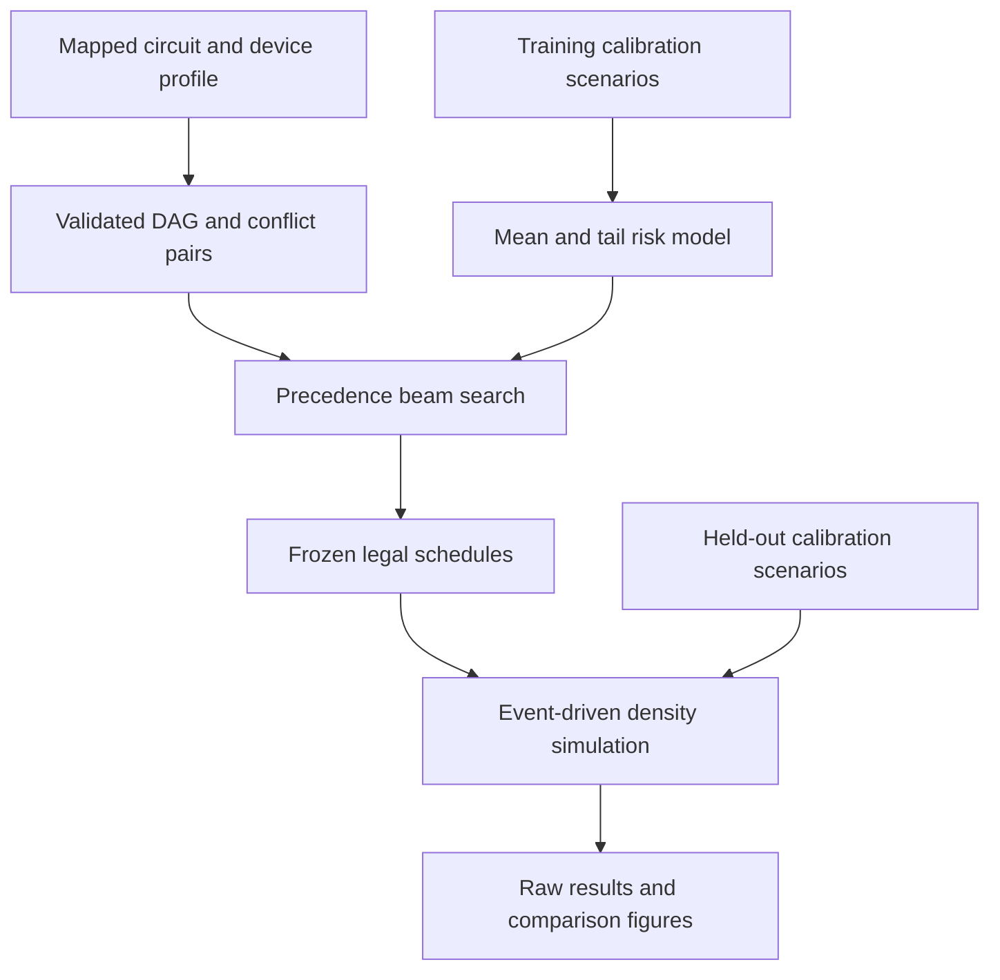

# QGuard

**Robust crosstalk-aware scheduling for mapped quantum circuits.**

[](https://github.com/yoyocar2333/QGuard/actions/workflows/tests.yml)
[](LICENSE)

QGuard explores a concrete Quantum EDA question: **how much execution time should
a compiler trade for reduced exposure to uncertain crosstalk?** It combines a
validated circuit IR, scenario-based scheduling, an explicit density-matrix noise
simulator, and reproducible held-out experiments.

**Status: research prototype, v0.1.0.** All bundled calibration profiles are
synthetic. This repository does not claim hardware-validated improvement or a
globally optimal scheduler. It is an engineering and experimental foundation for
studying those questions.


## Why this exists

Parallel two-qubit operations can interfere. Serializing every conflicting pair
reduces overlap but adds waiting time and idle decoherence. Optimizing against a
single calibration estimate can also select schedules that are fragile under
parameter uncertainty.

QGuard makes these tradeoffs inspectable. **Scheduling risk and simulated fidelity
are different quantities**: the scheduler minimizes a documented, inexpensive
surrogate; evaluation propagates density matrices and computes fidelity to the
ideal output state on held-out calibration draws. Both gains and regressions are
retained.

Existing work already studies crosstalk-aware scheduling, notably Murali et al.
(ASPLOS 2020). QGuard's experimental focus is the interaction of scenario
uncertainty, upper-tail risk, and a constrained scheduling search. Novelty beyond
this implementation requires a broader literature review and stronger evaluation.

## Measured reference result

On the bundled synthetic suite at held-out dispersion sigma=1.0, robust vs.
nominal scheduling improves mean fidelity by **0.658 percentage points** and the
mean per-circuit 10th percentile by **2.244 points**, while increasing mean
makespan by **25.65%**. One brickwork case regresses.

**The scenario-mean baseline slightly outperforms CVaR weighting in this run.**
These results support scenario-based scheduling, but do not establish an added
benefit from the tail term. See [all results and qualifications](docs/results.md).

## Implemented

- Fixed physical mapping, gate durations, native-edge checks, and per-qubit DAG dependencies.
- ASAP, conservative conflict serialization, nominal-risk, scenario-mean, and CVaR-aware beam-search schedulers.
- A small exhaustive oracle for the **precedence-augmented ASAP family**.
- Event-driven idle amplitude damping/dephasing, gate Pauli errors, and overlap-dependent coherent/stochastic ZZ channels.
- NumPy density propagation plus optional Qiskit Aer cross-validation.
- Independently seeded training/test scenarios, raw per-draw data, configuration hash, environment metadata, and static SVG reports.
- JSON input/output and a narrow OpenQASM 2 import adapter.

## Architecture



The optimizer never receives held-out draws. Test scenarios are generated after
all methods have selected their schedules. All methods see the same evaluation
draws for a given circuit and dispersion level.

## Install

Python 3.10+; no GPU, quantum hardware account, or commercial solver is required.

```bash
git clone https://github.com/yoyocar2333/QGuard.git
cd QGuard
python -m venv .venv
source .venv/bin/activate
python -m pip install -e '.[dev,validation]'
```

On Windows PowerShell, activate with `.venv\Scripts\Activate.ps1`.
For the core CLI and NumPy simulator only, use `python -m pip install -e .`.
The `validation` extra installs Qiskit/Aer for independent backend checks and
OpenQASM import. The tested versions are recorded in
[`requirements-reference.txt`](requirements-reference.txt).

## First experiment

```bash
qguard example --family qaoa --qubits 4 --depth 1 --output results/problem.json
qguard schedule results/problem.json --method robust --simulate --output results/schedule.json
qguard benchmark --quick --output results/quick
```

`--simulate` reports fidelity under the **nominal** scenario, not a robust
generalization result. Use `benchmark` for held-out evaluation.

The benchmark writes:

- `results.json`: configuration, exact circuits/profiles, frozen schedules, every training/test draw, and every fidelity value.
- `summary.csv`: macro-average metrics by method and dispersion.
- `robustness.svg`: mean fidelity and mean per-circuit 10th-percentile fidelity.
- `schedule.svg`: a predefined QAOA example, not a best-performing case selected after evaluation.
- `per_circuit.svg`: all individual workload gains and regressions.

## Reproduce the reference benchmark

```bash
qguard benchmark --config benchmarks/reference-config.json --output results/reference
qguard plot results/reference/results.json --output results/replotted
python -m pytest -q
```

The reference suite uses GHZ, QFT with nontrivial input, line-MaxCut QAOA, and random
brickwork circuits; 4 and 6 qubits; two circuit seeds; 16 training draws; and 24
held-out draws at each of three dispersion levels. The raw data and figures in
[`benchmarks/reference/`](benchmarks/reference/) were generated by this code.
See [the experiment report](docs/results.md) for measured outcomes and limitations.

These are small state-level experiments, not a scalability claim. Dense
simulation uses O(4^n) storage and defaults to a 10-qubit allocation guard.
Scheduling itself does not allocate quantum states.

## Input format

[`examples/qaoa4.json`](examples/qaoa4.json) is a complete editable example. It
contains a circuit, device coupling map, interference edges, tick duration, and
nominal calibration scenario. Times are integer **ticks**; T1/T2 are in ticks;
stochastic ZZ rates are per tick; coherent ZZ angular rates are radians/tick.
One tick in the bundled example is 20 ns.

The supported gates are `h`, `x`, `rx`, `ry`, `rz`, `cx`, `cz`, `cp`, and `swap`.
Qubit 0 is the most significant statevector bit in QGuard. Device coupling edges
are undirected in v0.1; asymmetric native-gate directionality is not modeled.

To import an already-mapped unitary OpenQASM 2 circuit:

```bash
qguard from-qasm examples/bell.qasm --output results/bell.json
qguard schedule results/bell.json --method asap --simulate --output results/bell-schedule.json
```

The adapter creates a **synthetic** device profile, which should be edited before
using a different topology or calibration. Unsupported operations, including
measurements, reset, and barriers, are rejected; they are not silently removed.

## Algorithms and evaluation

| Method | Information used | Decision |
|---|---|---|
| ASAP | Dependencies, durations | Start as soon as legal |
| Conservative | Dependencies, interference graph | Serialize all potentially interfering operation pairs in input order |
| Nominal | One calibration profile | Minimize the surrogate using beam search |
| Scenario mean | Training draws | Minimize average surrogate risk |
| Robust | Same training draws | Minimize a mixture of mean risk and empirical upper-tail CVaR |

The scenario-mean baseline isolates the effect of **tail weighting** from simply
using multiple scenarios. Nominal/scenario-mean/robust use the same search limits.
The conservative baseline is reported as a diagnostic even if it exceeds their
makespan budget.

The search adds legal precedence edges between potentially interfering gates,
then recomputes earliest starts. It explores both serialization directions,
rejects cycles, and retains the best schedule encountered. An exhaustive oracle
enumerates all three decisions (no edge / a before b / b before a) for each
conflict pair, subject to a small-instance guard. **This is not an oracle over all
possible integer or continuous start times.**

Full definitions, channel ordering, and complexity are in
[`docs/methods.md`](docs/methods.md).

## Validation

The test suite covers analytical Bell states, reversed qubit order, analytic idle
decay, Kraus completeness, density-matrix positivity/trace, half-open overlap
boundaries, zero-noise rescheduling equivalence, legal schedules, search budget,
empirical CVaR with fractional tail mass, tiny exhaustive comparisons, reproducible
held-out results, CLI I/O, and Qiskit cross-checks.

Aer independently propagates matrices through the generated channel sequence; it
shares QGuard's event generator. Analytical event-boundary tests cover that shared
component. A separate ideal-state test constructs native Qiskit gates without
using QGuard's matrices. Tests requiring Qiskit skip when the optional extra is
absent; CI explicitly installs it in its validation job.

## Scope and next research steps

1. Replace synthetic uncertainty with independently collected calibration data.
2. Evaluate more topologies and circuit seeds, report confidence intervals, and compare against a faithful published scheduling baseline.
3. Add arbitrary timing decisions or a CP-SAT/MILP model, with solver bounds on small instances.
4. Improve the surrogate's relation to state-level error; sweep tail weights and uncertainty assumptions using a separate validation set.
5. Add mapping/routing candidate selection and scalable DD/trajectory evaluation.

The present model lumps ideal gates at their completion times, applies idle
relaxation only while qubits are idle, and represents active-gate error by gate
Pauli channels plus spectator ZZ. It is not a driven-Hamiltonian or pulse-level
model. Readout, leakage, measurement feedback, and time-varying within-execution
calibration are outside v0.1.

## Repository map

| Path | Purpose |
|---|---|
| `src/qguard/model.py` | Validated circuit, device, scenario and schedule IR |
| `src/qguard/scheduling.py` | DAG scheduling, risk objective, beam search, finite-family oracle |
| `src/qguard/simulator.py` | Channels, event semantics, NumPy and Aer execution |
| `src/qguard/noise.py` | Explicit synthetic uncertainty model |
| `src/qguard/circuits.py` | Reproducible workload generators |
| `src/qguard/benchmark.py` | Frozen-schedule held-out evaluation and raw-data export |
| `src/qguard/io.py`, `cli.py`, `plotting.py` | Input adapters, CLI, and figures |
| `tests/` | Physics, algorithms, and integration checks |
| `docs/` | Methods, results, and Chinese development guide |

For a guided explanation in Chinese, start with
[`docs/development_zh.md`](docs/development_zh.md).

## References

- P. Murali, D. C. McKay, M. Martonosi, and A. Javadi-Abhari, **Software Mitigation of Crosstalk on Noisy Intermediate-Scale Quantum Computers**, ASPLOS 2020. [Paper](https://arxiv.org/abs/2001.02826), [DOI](https://doi.org/10.1145/3373376.3378477). Related work, not a reproduced baseline in this release.
- R. T. Rockafellar and S. Uryasev, **Optimization of Conditional Value-at-Risk**, Journal of Risk, 2000. [DOI](https://doi.org/10.21314/JOR.2000.038). Background for the risk measure; the empirical implementation is explicit in this repository.
- IBM Quantum, [Monitoring, calibrations, and benchmarking](https://quantum.cloud.ibm.com/docs/en/guides/calibration-jobs). Motivation for studying uncertain calibration parameters.
- Qiskit Aer, [AerSimulator documentation](https://qiskit.github.io/qiskit-aer/stubs/qiskit_aer.AerSimulator.html). Independent density-matrix backend.

## License and contributions

MIT; see [LICENSE](LICENSE). Contributions should include a minimal example,
validation of numerical or scheduling correctness, and a clear statement of any
model assumptions. See [CONTRIBUTING.md](CONTRIBUTING.md).

Initial implementation was developed with AI assistance. Numerical and algorithmic
claims are backed by the supplied tests and recorded runs, within the scope stated
above. Cite the repository using [CITATION.cff](CITATION.cff); cite related research
separately.
