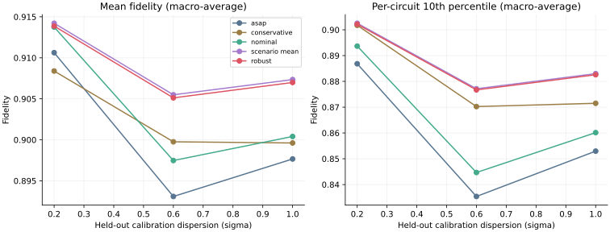
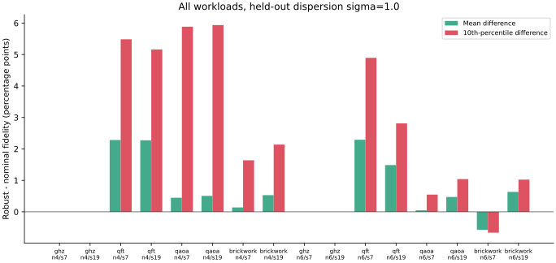
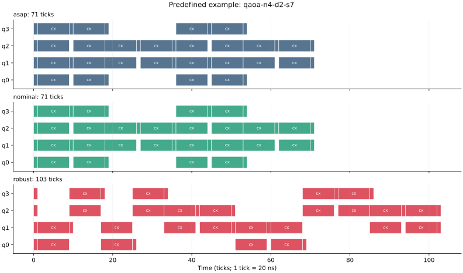

# Reference experiment: v0.1.0

These are measured simulator results under synthetic calibration profiles. No quantum hardware was used.

## Protocol

- 16 workload entries: GHZ, QFT, QAOA and brickwork; 4/6 qubits; seeds 7 and 19; depth 2.
- 14 distinct circuits: the two GHZ seeds at each width generate the same control circuit.
- 16 training scenarios; 24 independent test scenarios per dispersion (0.2, 0.6, 1.0).
- Five methods; 5,760 method/circuit/scenario fidelity entries. Identical schedules reuse computed states.
- Beam width 12, 6 rounds, makespan at most 2x ASAP for the search methods.
- Training seed 2026; separate test SeedSequence streams rooted at 9026.
- Settings were fixed before the reference evaluation; no test-driven parameter sweep was used.
- Recorded wall time: 565.59 s on the recorded environment; timing is machine-dependent.
- Configuration SHA-256: `5d47447761cef8a986833759d08df87a5503aa5f5ae506bf5ed40c1958878ffb`.

## Held-out fidelity

Mean and p10 columns are macro-averages of per-circuit statistics. P10 is not a pooled quantile.

| Dispersion | Method | Mean fidelity | Mean per-circuit p10 | Mean makespan (ticks) |
|---:|---|---:|---:|---:|
| 0.2 | asap | 0.910629 | 0.886828 | 45.75 |
| 0.2 | conservative | 0.908391 | 0.901742 | 66.38 |
| 0.2 | nominal | 0.913752 | 0.893669 | 47.75 |
| 0.2 | scenario_mean | 0.914215 | 0.902531 | 59.75 |
| 0.2 | robust | 0.913871 | 0.902155 | 60.00 |
| 0.6 | asap | 0.893091 | 0.835380 | 45.75 |
| 0.6 | conservative | 0.899759 | 0.870233 | 66.38 |
| 0.6 | nominal | 0.897476 | 0.844674 | 47.75 |
| 0.6 | scenario_mean | 0.905493 | 0.877144 | 59.75 |
| 0.6 | robust | 0.905117 | 0.876700 | 60.00 |
| 1.0 | asap | 0.897665 | 0.852958 | 45.75 |
| 1.0 | conservative | 0.899615 | 0.871501 | 66.38 |
| 1.0 | nominal | 0.900408 | 0.860136 | 47.75 |
| 1.0 | scenario_mean | 0.907346 | 0.882998 | 59.75 |
| 1.0 | robust | 0.906993 | 0.882575 | 60.00 |

## What the data supports

At sigma=1.0, robust scheduling raises mean fidelity from 0.900408 (nominal) to 0.906993: **+0.658 percentage points**. The macro-average per-circuit p10 rises from 0.860136 to 0.882575: **+2.244 percentage points**. Mean makespan increases from 47.75 to 60.00 ticks (**+25.65%**, ratio of means).

Across the 16 entries at sigma=1.0, robust improves mean fidelity on 11, ties on the 4 GHZ controls, and regresses on one brickwork circuit. It is not uniformly better. The regression and all other entries appear in the figure below.

**Scenario-mean slightly outperforms the CVaR-weighted method in this suite.** At sigma=1.0 its mean is 0.907346 and p10 is 0.882998, versus robust 0.906993 and 0.882575. The two methods select identical start times on 14 of 16 entries. The experiment therefore supports scenario-based scheduling as a useful direction, but does **not** demonstrate an incremental advantage from CVaR weighting.

At sigma=0.2, robust and nominal macro-average means are almost equal; the more conservative timing is mostly useful for the lower tail. More independent circuits and calibration sets are needed before any statistical or general performance claim.







## Small-instance oracle check

Separate 4-qubit, depth-1 inputs compare beam search with complete enumeration of the precedence-augmented ASAP family. All four match the finite-family optimum here; this is not a guarantee for larger problems or arbitrary timed schedules.

| Circuit | Conflict pairs | Distinct oracle schedules | Relative objective gap |
|---|---:|---:|---:|
| ghz-n4-d1-s7 | 0 | 1 | 0.000000 |
| qft-n4-d1-s7 | 1 | 3 | 0.000000 |
| qaoa-n4-d1-s7 | 4 | 13 | 0.000000 |
| brickwork-n4-d1-s7 | 1 | 3 | 0.000000 |

## Validation and reproduction

The local test suite passes 30 tests with Qiskit/Aer installed. Ruff also passes. The reference run uses the versions in `requirements-reference.txt`; raw JSON contains environment metadata.

```bash
python -m pip install -r requirements-reference.txt
python -m pip install --no-deps -e .
python -m pytest -q
qguard benchmark --config benchmarks/reference-config.json --output results/reference
```

Source data: [raw results](../benchmarks/reference/results.json), [summary CSV](../benchmarks/reference/summary.csv), [oracle check](../benchmarks/oracle.json).

## Limits

Synthetic all-to-all native connectivity and chain interference links, small dense-state circuits, one training calibration set per width, a shared event generator across numerical backends, and the restricted search family limit generalization. The plotted curve need not decrease monotonically with dispersion because each level uses independent finite draws. Twenty-four samples yield a noisy tail statistic; no confidence interval or significance claim is made.

The next experiment should use a distinct validation set to select risk settings, additional calibration draws/topologies, a faithful published baseline, and a more state-sensitive surrogate. Preserve this run as the fixed v0.1 baseline.
